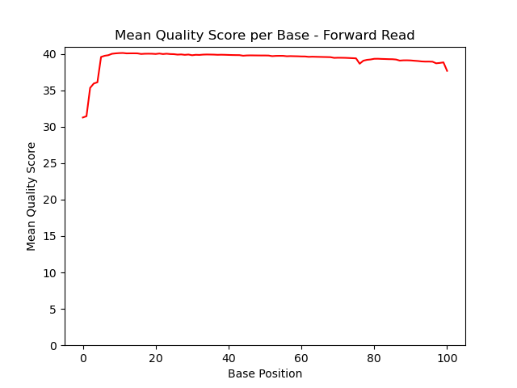
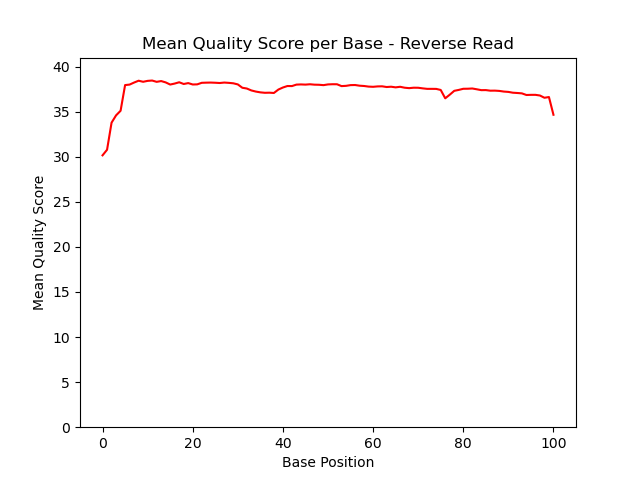
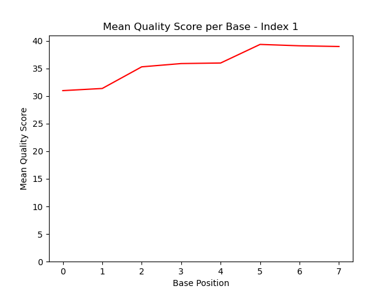
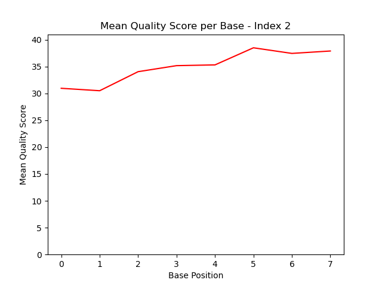

# Assignment the First

## Part 1
1. Be sure to upload your Python script. Provide a link to it here: [FirstAssignment.py](FirstAssignment.py)

| File name | label | Read length | Phred encoding |
|---|---|---|---|
| 1294_S1_L008_R1_001.fastq.gz | forward read | 101 | +33 |
| 1294_S1_L008_R2_001.fastq.gz | index 1 | 8 | +33 |
| 1294_S1_L008_R3_001.fastq.gz | index 2 | 8 | +33 |
| 1294_S1_L008_R4_001.fastq.gz | reverse read | 101 | +33 |

2. Per-base NT distribution
    1. Use markdown to insert your 4 histograms here.
    
    
    
    
    


# First Assignment Part 1 Questions
Length of read in 1294_S1_L008_R1_001.fastq.gz:

```zcat /projects/bgmp/shared/2017_sequencing/1294_S1_L008_R1_001.fastq.gz | awk 'NR == 2 || NR % 4 == 2' | head -50 | awk '{ print length }'```

This gives me a charcter length of 101 in each line.


Length of read in 1294_S1_L008_R2_001.fastq.gz:

```zcat /projects/bgmp/shared/2017_sequencing/1294_S1_L008_R2_001.fastq.gz | awk 'NR == 2 || NR % 4 == 2' | head -50 | awk '{ print length }'```

This gives me a charcter length of 8 in each line.


Length of read in 1294_S1_L008_R3_001.fastq.gz:


```zcat /projects/bgmp/shared/2017_sequencing/1294_S1_L008_R3_001.fastq.gz | awk 'NR == 2 || NR % 4 == 2' | head -50 | awk '{ print length }'```

This gives me a charcter length of 8 in each line.


Length of read in 1294_S1_L008_R4_001.fastq.gz:

```zcat /projects/bgmp/shared/2017_sequencing/1294_S1_L008_R4_001.fastq.gz | awk 'NR == 2 || NR % 4 == 2' | head -50 | awk '{ print length }'```

This gives me a charcter length of 101 in each line.


Phred encoding:

```zcat 1294_S1_L008_R1_001.fastq.gz | head -4 | tail -1```
```A#A-<FJJJ<JJJJJJJJJJJJJJJJJFJJJJFFJJFJJJAJJJJ-AJJJJJJJFFJJJJJJFFA-7<AJJJFFAJJJJJF<F--JJJJJJF-A-F7JJJJ```

The ```<``` indicates a +33 phred encoding.


```zcat 1294_S1_L008_R2_001.fastq.gz | head -4 | tail -1```
```#AA<FJJJ```

The ```<``` indicates a +33 phred encoding.


```zcat 1294_S1_L008_R3_001.fastq.gz | head -4 | tail -1```
```#AAAAJJF```

The ```#``` indicates a +33 phred encoding.


```zcat 1294_S1_L008_R4_001.fastq.gz | head -4 | tail -1```
```#AAFAFJJ-----F---7-<FA-F<AFFA-JJJ77<FJFJFJJJJJJJJJJAFJFFAJJJJJJJJFJF7-AFFJJ7F7JFJJFJ7FFF--A<A7<-A-7--```

The ```#``` and ```-``` indicate a +33 phred encoding.

1. What is a good quality score cutoff for index reads and biological read pairs to utilize for sample identification and downstream analysis, respectively? Justify your answer.

I would suggest a quality score cutoff of 26 for the average of the entire read. This is below the minimum average quality score for any base position in all four fastq files. None of the average qscores for each base position falls below 30, so 26 would allow for qscores less than average but not so far below that it would include a majority of low quality base calls. 

2. How many indexes have undetermined (N) base calls? (Utilize your command line tool knowledge. Submit the command(s) you used. CHALLENGE: use a one-line command)


```zcat /projects/bgmp/shared/2017_sequencing/1294_S1_L008_R2_001.fastq.gz | awk 'NR == 2 || NR % 4 == 2' | grep "N" | wc -l```
Count: 3976613

```zcat /projects/bgmp/shared/2017_sequencing/1294_S1_L008_R3_001.fastq.gz | awk 'NR == 2 || NR % 4 == 2' | grep "N" | wc -l```
Count: 3328051

Total: 7304664


## Part 2
1. Define the problem
    
    We need to de-multiplex fastq files in order to identify the level of index swapping and undetermined index-pairs.
   
3. Describe output

    We will output 48 FASTQ files of matching index pairs (read1 and read2 for 24 different index pairs), two FASTQ files with index-hopped reads-pairs, and two FASTQ files for undetermined (non-matching or low quality) index-pairs.
   
5. Upload your [4 input FASTQ files](../TEST-input_FASTQ) and your [>=6 expected output FASTQ files](../TEST-output_FASTQ).

6. Pseudocode

1) Read in all four fastq files (while True loop)
2) Record the 4 lines per each record (Header, sequence, +, q scores)
3) Append the header lines with the indexes for that record
4) Perform the reverse complement of the R3 index
5) Check for N's or low quality indexes; If so, write to unknown/low-quality files(2 files total, R1 and R4)
6) Determine if indexes match; If match, write to matched files(2 files for each index pair, R1 and R4). If not matched, write to index-hopping files(2 files total, R1 and R4)
7) Keep counters of records in each file type
8) Calculate statistics of index files. (mean, max, min q score for each index, count of each index pair, etc.)


7. High level functions. For each function, be sure to include:
    1. Description/doc string
    2. Function headers (name and parameters)
    3. Test examples for individual functions
    4. Return statement


def reverse_complement(index_line: str):
    ```This function will take in the 2nd index records and write the reverse complement.```
    return reverse_comp
Input: CCGTAATC
Expected output: GATTACGG


def edit_header(header_line1: str, header_line2:):
    ```This function will take in the header lines from R1 and R4 files and the index line from R2 and reverse complement of the index in R3. It will edit the header line in R1 and R4 files to append the indexes from R2 and R3 at the end of the line```
    return header_line1, header_line2
 Input: @test-1 matched-index_R1, @test-1 matched-index_R4, CCGTAATC, CCGTTTAC
Expected output: @test-1 matched-index_R1_CCGTAATC-CCGTTTAC, @test-1 matched-index_R4_CCGTAATC-CCGTTTAC


def is_match(index_line1: str, index_line2: str):
    ```This will check to see if the index line from R2 and the reverse complement of R3 match. If there is a match, it will append the corresponding sequence records into a file for matching indexes. If there is no match, it will append the corresponding sequence records in a file for index hopping.``` 
    return R1_match_file, R4 match_file OR R1_unknown_file, R4_unknown_file
Input: CCGTAATC, CCGTAATC
Expected output: R1_match_file, R4 match_file
OR
Input: CCGTAATC, CCGTTTAA
Expected output: R1_unknown_file, R4_unknown_file


def q_score_thres(index1_qscore: str, index2_qscore: str):
    ```This function will check to see if the average q score of the index line meets a certain threshold. If the average q score does not meet a certain threshold, it will send the corresponding sequence records to the unknown index files.```
    return R1_unknown_file, R4_unknown_file
Input: JJAAEJJF, JJFFEFFJ
Output: None
OR
Input: #A##AFJF, #A###JFA
Expected output: R1_unknown_file, R4_unknown_file

